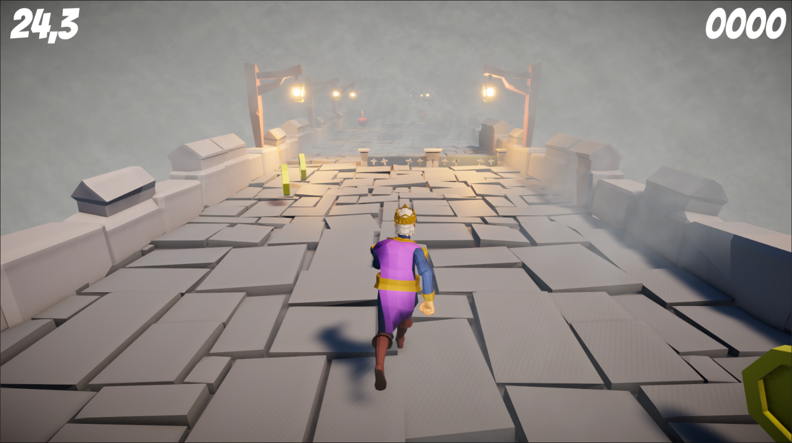
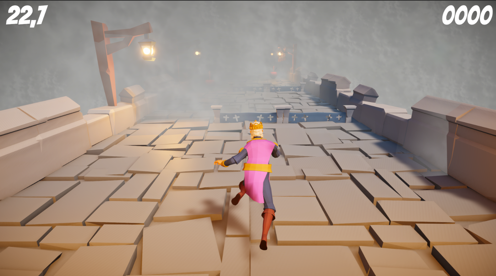
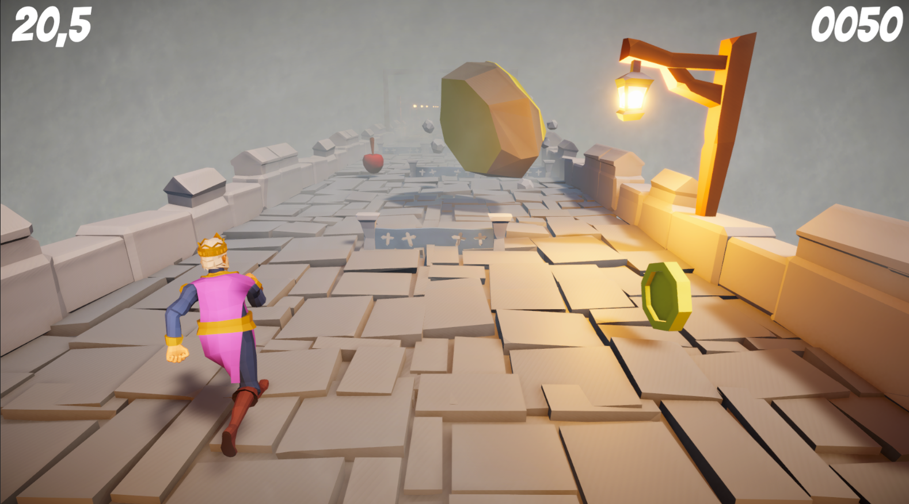
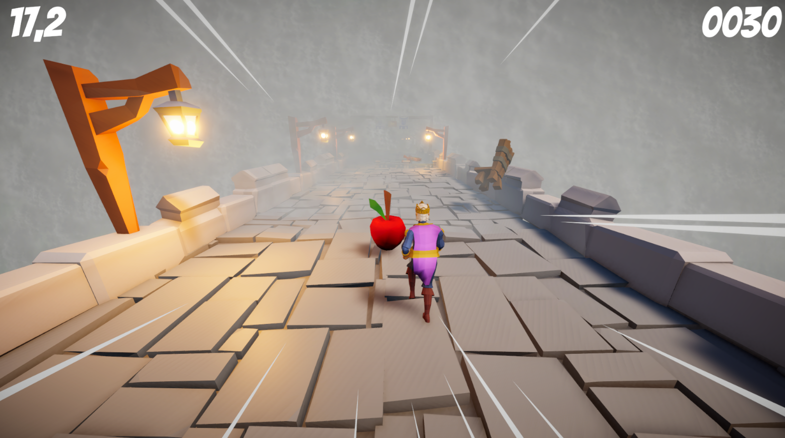
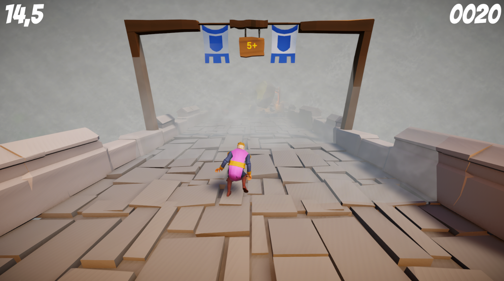

# Royal Run

**Royal Run** is an endless runner controlled with WASD. The goal is to survive as long as possible without hitting obstacles.

## Gameplay

- **+5 second zones**: Extend your time.  
- **Coins**: Increase your score.  
- **Apples**: Boost your speed.  
- Hitting obstacles or incoming objects slows the character and deducts 10 points.

## Controls

- **W**: Move up  
- **A**: Move left  
- **S**: Move down  
- **D**: Move right

## How to Play

- Avoid obstacles and incoming objects.  
- Collect coins and apples to increase score and speed.  
- Reach +5 second zones to extend your survival time.
- When speeding up: camera zooms out and particles appear  
- When slowing down: camera zooms in
- Assets/Screenshots/stumbleanimation.png

## What I Learned

- Unity animations and Animator system  
- Unity physics system  
- Using `IEnumerator` to create coroutines  
- Scoreboard and UI implementation  
- Strengthened understanding of `OnCollisionEnter` method  
- Camera control and effects for speed changes (zoom out when speeding up, zoom in when slowing down)  
- Particle effects triggered by speed changes

## Screenshots

### Player & Effects
| Description | Screenshot |
|-------------|------------|
| **Player Movement** | When game starts, the player begins to run. |  |
| **Stumble Animation** | When the player hits an obstacle (rock, chair, desk, etc.), their movement speed is reduced and a "stumble" animation is triggered. |  |
| **Falling Obstacles** | Obstacles are spawned using Unity’s physics system. If the player collides with these obstacles, the player’s movement speed is temporarily reduced and they lose points. |  |
| **Speed Up** | When the player collects an apple, it temporarily increases their movement speed. |  |
| **Checkpoint** | When the player reaches a checkpoint, they gain 5 seconds of extra time. |  |

